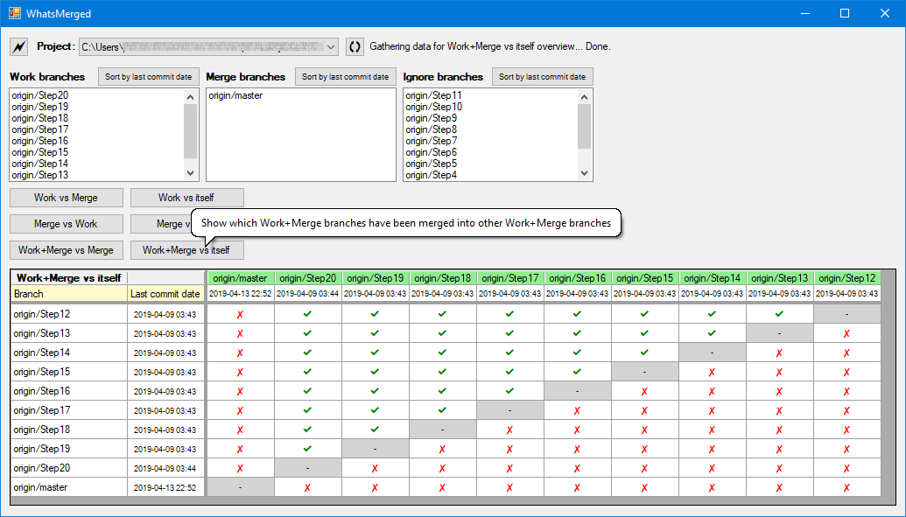

# WhatsMerged.WinForms
**Q**: What is it? 
**A**: **WhatsMerged.WinForms** is a *.NET Core 3.1* based Windows Forms front-end for showing a branch-by-branch "What has been merged"-overview of your GIT-based projects.

**Q**: How does it look? 
**A**: See image: 

**WhatsMerged.WinForms** properties and features:

- Built using **Visual Studio 2019** and **.NET Core 3.1**.
- The **WhatsMerged.WinForms** project is dual targeted for .NET Core 3.1 and .NET Framework 4.7.2. The reason is that the VS 2019 Forms Designer only works when targeting .NET Framework; offering the same support for .NET Core-only projects is still a [Work-In-Progress](https://devblogs.microsoft.com/dotnet/updates-to-net-core-windows-forms-designer-in-visual-studio-16-5-preview-1/).
- When running, WhatsMerged.WinForms uses your locally installed **git.exe** (which must be available through your **`PATH`**) to access the repos that you are already using.
- You can tell WhatsMerged.WinForms where to look for repo folders, which it will then find by doing a disk scan.
- WhatsMerged.WinForms works exclusively on *remote branches*. It is *fine* to have any branch checked out locally, or even to have work in progress - none of this is relevant to WhatsMerged.WinForms, because it only examines *remote branches* (prefixed with **`origin/`**).
- WhatsMerged.WinForms works best with projects for which work typically happens in branches like **`feature/xyz`**, **`bugfix/xyz`**, **`hotfix/xyz`** etc. which then get merged into branches with common names such as **`develop`**, **`test`**, **`release`** (or **`release/1.1`**, **`release/1.2`**, etc) and finally **`master`**.
